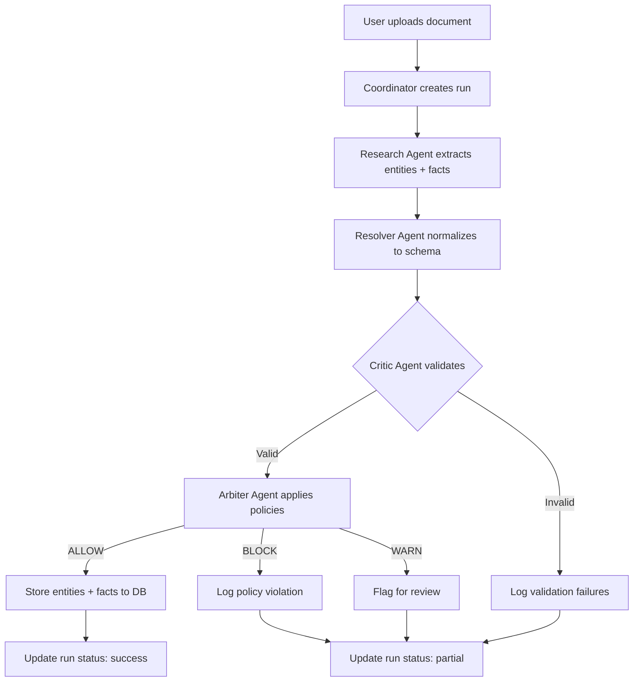

# System Architecture - Company Truth Weave

## Table of Contents
1. [Overview](#overview)
2. [Technology Stack](#technology-stack)
3. [Architecture Layers](#architecture-layers)
4. [Data Flow](#data-flow)
5. [Agent Responsibilities](#agent-responsibilities)
6. [Database Schema](#database-schema)
7. [Security Model](#security-model)
8. [Performance Characteristics](#performance-characteristics)
9. [Known Limitations](#known-limitations)

---

## Overview

Company Truth Weave is a **multi-agent knowledge graph builder** that transforms unstructured company documents (press releases, filings, web pages) into a validated, queryable knowledge graph. The system uses a pipeline of specialized AI agents with built-in quality gates to ensure data accuracy, citation compliance, and policy adherence.

### Key Capabilities

- **Entity Extraction**: Automatically identifies companies, people, and products from raw text
- **Fact Normalization**: Converts statements into subject-predicate-object triples with evidence
- **Quality Validation**: Detects contradictions, enforces citations, validates confidence scores
- **Policy Enforcement**: Blocks PII, intellectual property violations, and missing citations
- **Full Auditability**: Every extraction tracked with lineage, metrics, and decision rationale

---

## Technology Stack

### Frontend
- **React 18** with TypeScript for type safety
- **Vite** for fast development builds
- **Tailwind CSS** + **shadcn/ui** for design system
- **TanStack Query** for data fetching and caching
- **React Router** for client-side routing

### Backend
- **Supabase** (PostgreSQL + Edge Functions)
  - **Database**: PostgreSQL 15 with `pgvector` extension
  - **Edge Functions**: Deno runtime for serverless AI agents
  - **Realtime**: WebSocket-based live updates
  - **Auth**: Row-level security (RLS) with JWT tokens

### AI Integration
- **Lovable AI** (Gemini 2.5 Flash) - Default for most agents
- **OpenAI API** (GPT-5 Mini, GPT-4.1 Mini) - For specific use cases
- **Model-Agnostic Caller** (`ai-caller.ts`) - Abstracts API differences

### Observability
- **PromptOps Layer** - Versioned prompts with A/B testing
- **Run Logging** - Comprehensive execution tracking
- **Guardrail Results** - Policy gate outcomes per run

---

## Architecture Layers

```
┌─────────────────────────────────────────────────────────────────┐
│                        Frontend (React SPA)                       │
│  - CompanySearch, DocumentLibrary, FactsBrowser, IngestionMonitor │
│  - Authentication, Authorization, Role-Based Access               │
└─────────────────────────────────────────────────────────────────┘
                              ▼
┌─────────────────────────────────────────────────────────────────┐
│                      API Gateway (Supabase Client)                │
│  - supabase.from('entities').select() → PostgreSQL                │
│  - supabase.functions.invoke('coordinator') → Edge Functions      │
│  - supabase.auth → JWT token management                          │
└─────────────────────────────────────────────────────────────────┘
                              ▼
┌─────────────────────────────────────────────────────────────────┐
│              Edge Functions (Deno Serverless Runtime)             │
│  ┌────────────┐  ┌────────────┐  ┌────────────┐  ┌────────────┐ │
│  │ Research   │→ │ Resolver   │→ │ Critic     │→ │ Arbiter    │ │
│  │ Agent      │  │ Agent      │  │ Agent      │  │ Agent      │ │
│  └────────────┘  └────────────┘  └────────────┘  └────────────┘ │
│                              ▲                                    │
│                    Coordinated by                                 │
│                    Coordinator Function                           │
└─────────────────────────────────────────────────────────────────┘
                              ▼
┌─────────────────────────────────────────────────────────────────┐
│          AI Abstraction Layer (ai-caller.ts)                      │
│  - Normalizes OpenAI Responses API vs Chat Completions API        │
│  - Handles temperature/seed/reasoning_effort differences           │
│  - Fetches model configs from database                            │
└─────────────────────────────────────────────────────────────────┘
                              ▼
┌─────────────────────────────────────────────────────────────────┐
│           Database (PostgreSQL + pgvector)                        │
│  - Core Data: entities, documents, facts                          │
│  - PromptOps: prompt_versions, prompt_bindings, rollouts         │
│  - Observability: runs, node_runs, message_logs                  │
│  - Governance: guardrail_results, change_requests                │
└─────────────────────────────────────────────────────────────────┘
```

---

## Data Flow

### Document Ingestion Pipeline



### Agent Execution Flow

1. **Coordinator** receives `{ documentText, documentId, environment }`
2. **Research Agent** calls AI model with document text → extracts entities/facts
3. **Resolver Agent** normalizes extracted data to canonical schema
4. **Critic Agent** validates facts for contradictions, confidence ranges, citations
5. **Arbiter Agent** applies policy gates (PII, IP, compliance)
6. **Conditional Storage**:
   - Entities stored after Resolver (before Arbiter)
   - Facts stored only if Arbiter decision = `ALLOW`
7. **Run Finalization**: Update run status (`success`, `partial`, `failed`)

---

## Agent Responsibilities

### 1. Research Agent
**Purpose**: Extract entities and facts from raw document text

**Input**:
```typescript
{
  documentText: string,
  documentId: string,
  environment: 'dev' | 'staging' | 'prod'
}
```

**Output**:
```typescript
{
  entities: [
    { legal_name, entity_type, identifiers, website, metadata }
  ],
  facts: [
    { subject, predicate, object, confidence, evidence_text, evidence_span }
  ]
}
```

**Model**: `google/gemini-2.5-flash` (Lovable AI) or `gpt-4.1-mini` (OpenAI)

---

### 2. Resolver Agent
**Purpose**: Normalize and deduplicate extracted data

**Input**:
```typescript
{
  entities: [...],  // Raw entities from Research Agent
  facts: [...]      // Raw facts from Research Agent
}
```

**Output**:
```typescript
{
  normalized: {
    normalized_entities: [
      { canonical_name, original_name, entity_type, derived: {...} }
    ],
    normalized_facts: [
      { 
        derived: { 
          triple: { subject, predicate, object },
          evidence: { text, document_id, span },
          confidence, status 
        }
      }
    ]
  }
}
```

**Model**: `gpt-5-nano` (fast deduplication)

---

### 3. Critic Agent
**Purpose**: Validate facts for quality and consistency

**Input**:
```typescript
{
  documentId: string,
  facts: [...],  // Normalized facts from Resolver
  environment: string
}
```

**Checks**:
- Contradictions (same subject+predicate, different objects)
- Citation enforcement (evidence_text present)
- Confidence score ranges (0.0-1.0)
- Required fields present

**Output**:
```typescript
{
  validation: {
    is_valid: boolean,
    total_facts: number,
    issues: [
      { type, severity, message, fact_index }
    ]
  }
}
```

**Model**: `gpt-5-mini` (reasoning for QA)

**Critical Fix (2025-10-30)**: Removed unsupported `temperature` and `seed` parameters for Responses API compatibility

---

### 4. Arbiter Agent
**Purpose**: Apply policy gates (PII, IP, compliance)

**Input**:
```typescript
{
  facts: [...],
  entities: [...],
  environment: string
}
```

**Policy Gates**:
- **PII Detection**: Phone numbers, email addresses, SSNs
- **IP Violations**: Proprietary data, trade secrets
- **Citation Enforcement**: Facts must have evidence_text
- **Confidence Thresholds**: Block facts with confidence < 0.5

**Output**:
```typescript
{
  policy: {
    decision: 'ALLOW' | 'BLOCK' | 'WARN',
    reason: string,
    violations: [
      { rule, severity, affected_items }
    ]
  }
}
```

**Model**: `gpt-5-nano` (rule application)

---

### 5. Coordinator
**Purpose**: Orchestrate the multi-agent pipeline

**Features**:
- Exponential backoff retry logic (max 5 retries)
- Budget enforcement (max 5 agent calls, 60s total latency)
- Conditional storage based on Arbiter decision
- Comprehensive error logging

**Run Status Determination**:
- `success`: All agents completed, Arbiter approved
- `partial`: Some agents failed OR Arbiter blocked/warned
- `failed`: Critical agents failed (e.g., Research, Resolver)

---

## Database Schema

### Layer 1: Core Data (Entities, Documents, Facts)

#### `entities`
Stores companies, people, and products with identifiers.

| Column | Type | Description |
|--------|------|-------------|
| `id` | UUID | Primary key |
| `legal_name` | TEXT | Canonical company name |
| `entity_type` | TEXT | company, person, product |
| `identifiers` | JSONB | LEI, VAT, DUNS, etc. |
| `trading_names` | TEXT[] | Aliases, former names |
| `addresses` | JSONB[] | Structured addresses |
| `relationships` | JSONB[] | Parent/subsidiary links |
| `website` | TEXT | Primary URL |
| `metadata` | JSONB | Source, run_id, document_id |
| `created_at` | TIMESTAMPTZ | Timestamp |

**Indexes**: 
- `idx_entities_legal_name` (GIN for fuzzy search)
- `idx_entities_identifiers` (GIN for identifier lookups)

---

#### `documents`
Source documents with raw text and metadata.

| Column | Type | Description |
|--------|------|-------------|
| `id` | UUID | Primary key |
| `entity_id` | UUID | FK to entities (nullable) |
| `title` | TEXT | Document title |
| `doc_type` | TEXT | press_release, filing, etc. |
| `full_text` | TEXT | Complete document text |
| `published_at` | TIMESTAMPTZ | Publication date |
| `content_hash` | TEXT | SHA-256 for deduplication |
| `storage_url` | TEXT | Link to binary file |
| `metadata` | JSONB | Source, language, etc. |
| `created_at` | TIMESTAMPTZ | Timestamp |

**Foreign Keys**:
- `documents.entity_id → entities.id` (ON DELETE SET NULL)

**Indexes**:
- `idx_documents_entity_id` (for entity filtering)
- `idx_documents_content_hash` (for deduplication)

---

#### `facts`
Normalized statements with subject-predicate-object structure and evidence.

| Column | Type | Description |
|--------|------|-------------|
| `id` | UUID | Primary key |
| `subject` | TEXT | Entity name |
| `predicate` | TEXT | Relationship or attribute |
| `object` | TEXT | Value or target entity |
| `evidence_text` | TEXT | Citation from document |
| `evidence_doc_id` | UUID | FK to documents |
| `evidence_span_start` | INT | Character offset (start) |
| `evidence_span_end` | INT | Character offset (end) |
| `confidence` | NUMERIC(3,2) | 0.00-1.00 |
| `status` | TEXT | pending, verified, disputed, superseded |
| `created_by` | UUID | User or agent ID |
| `created_at` | TIMESTAMPTZ | Timestamp |

**Foreign Keys**:
- `facts.evidence_doc_id → documents.id` (ON DELETE SET NULL)

**Indexes**:
- `idx_facts_evidence_doc_id` (for document joins)
- `idx_facts_status` (for status filtering)

**Check Constraints**:
- `confidence BETWEEN 0.0 AND 1.0`
- `status IN ('pending', 'verified', 'disputed', 'superseded')`

---

### Layer 2: PromptOps (Versioned Prompts)

#### `prompt_templates`
Base template definitions before versioning.

| Column | Type | Description |
|--------|------|-------------|
| `template_id` | UUID | Primary key |
| `template_name` | TEXT | Unique template identifier |
| `description` | TEXT | Purpose and usage |
| `created_at` | TIMESTAMPTZ | Timestamp |

---

#### `prompt_versions`
Immutable prompt snapshots with semantic versioning.

| Column | Type | Description |
|--------|------|-------------|
| `version_id` | UUID | Primary key |
| `template_id` | UUID | FK to prompt_templates |
| `version_label` | TEXT | e.g., "v1.2.0" |
| `content_text` | TEXT | Actual prompt text |
| `content_hash` | TEXT | SHA-256 for drift detection |
| `state_code` | TEXT | draft, candidate, approved, retired |
| `created_at` | TIMESTAMPTZ | Timestamp |

---

#### `prompt_bindings`
Deploy a prompt version to an agent in an environment.

| Column | Type | Description |
|--------|------|-------------|
| `binding_id` | UUID | Primary key |
| `agent_id` | UUID | FK to agent_definitions |
| `version_id` | UUID | FK to prompt_versions |
| `env_code` | TEXT | dev, staging, prod |
| `traffic_weight` | INT | Percentage for A/B testing |
| `effective_from` | TIMESTAMPTZ | Rollout start |
| `effective_to` | TIMESTAMPTZ | Rollout end (nullable) |

**Indexes**:
- `idx_prompt_bindings_active` (WHERE effective_to IS NULL)

---

### Layer 3: Observability (Runs, Logs)

#### `runs`
Workflow-level execution records (coordinator runs).

| Column | Type | Description |
|--------|------|-------------|
| `run_id` | UUID | Primary key |
| `env_code` | TEXT | dev, staging, prod |
| `status_code` | TEXT | running, success, partial, failed |
| `started_at` | TIMESTAMPTZ | Run start time |
| `ended_at` | TIMESTAMPTZ | Run end time (nullable) |
| `metrics_json` | JSONB | Latency, agent calls, errors |

**Indexes**:
- `idx_runs_status_started` (for monitoring dashboards)

---

#### `node_runs`
Individual agent execution records.

| Column | Type | Description |
|--------|------|-------------|
| `node_run_id` | UUID | Primary key |
| `run_id` | UUID | FK to runs |
| `agent_id` | UUID | FK to agent_definitions |
| `status_code` | TEXT | success, error, timeout |
| `latency_ms` | INT | Execution time |
| `input_params` | JSONB | Agent inputs |
| `output_data` | JSONB | Agent outputs |
| `error_message` | TEXT | Failure reason |
| `created_at` | TIMESTAMPTZ | Timestamp |

**Indexes**:
- `idx_node_runs_run_id` (for run lineage queries)

---

#### `message_logs`
LLM conversation history per node run.

| Column | Type | Description |
|--------|------|-------------|
| `message_id` | UUID | Primary key |
| `node_run_id` | UUID | FK to node_runs |
| `message_role` | TEXT | system, user, assistant, tool |
| `message_content` | TEXT | Actual message text |
| `message_index` | INT | Order in conversation |
| `created_at` | TIMESTAMPTZ | Timestamp |

---

### Layer 4: Governance (Guardrails, Change Requests)

#### `guardrail_results`
Policy gate outcomes per run.

| Column | Type | Description |
|--------|------|-------------|
| `result_id` | UUID | Primary key |
| `run_id` | UUID | FK to runs |
| `guardrail_name` | TEXT | pii_scan, citation_check, etc. |
| `status_code` | TEXT | pass, warn, fail |
| `details_json` | JSONB | Violations, affected items |
| `created_at` | TIMESTAMPTZ | Timestamp |

---

## Security Model

### Authentication
- **Method**: JWT tokens issued by Supabase Auth
- **Providers**: Email/password, Google OAuth (extensible)
- **Session Management**: Auto-refresh tokens, secure httpOnly cookies

### Authorization (Row Level Security)

#### Admin Role
- Full access to all tables
- Can create/update/delete prompt versions and bindings
- Can manage user roles

#### Analyst Role
- Read-only access to entities, documents, facts
- Read access to runs and validation results
- Cannot modify prompt configurations

#### Viewer Role
- Read-only access to entities and documents only
- No access to internal observability tables

### RLS Policy Pattern

```sql
CREATE POLICY "Admins full access" ON entities
FOR ALL TO authenticated
USING (public.has_role(auth.uid(), 'admin'))
WITH CHECK (public.has_role(auth.uid(), 'admin'));

CREATE POLICY "Analysts read access" ON entities
FOR SELECT TO authenticated
USING (public.has_role(auth.uid(), 'analyst') OR public.has_role(auth.uid(), 'admin'));
```

### Agent Access
- Edge functions use **service role key** (bypasses RLS)
- All agent writes are logged in `node_runs` table
- Audit trail preserved for compliance

---

## Performance Characteristics

### Latency Targets

| Operation | Target | Notes |
|-----------|--------|-------|
| Prompt fetch | < 50ms (p95) | Cached in memory |
| Run logging write | < 150ms (p95) | Async background task |
| Document ingestion | < 15s (p95) | Full pipeline |
| Database query | < 200ms (p95) | With indexes |

### Throughput

- **Concurrent pipelines**: 10-20 simultaneous coordinator runs
- **Document size**: Up to 50K tokens (~200KB text)
- **Batch ingestion**: Not yet implemented (future work)

### Scalability

- **Database**: PostgreSQL with connection pooling (Supabase default)
- **Edge Functions**: Auto-scaling Deno runtime (Supabase default)
- **AI API**: Rate limits vary by provider (OpenAI: 10K RPM, Lovable AI: TBD)

### Cost Estimates

| Component | Monthly Cost (100 docs/day) |
|-----------|------------------------------|
| Supabase Pro | $25 |
| OpenAI API (GPT-5 Mini) | ~$50 |
| Lovable AI | Usage-based pricing |
| **Total** | ~$75-100/month |

---

## Known Limitations

### Current Constraints

1. **No Batch Ingestion**
   - Must process documents one-at-a-time
   - No concurrent pipeline execution from UI
   - Workaround: Call coordinator function in parallel via API

2. **No Vector Search**
   - Semantic search not yet implemented
   - Full-text search only (PostgreSQL `tsvector`)
   - Planned: `pgvector` + HNSW index for embeddings

3. **Limited Prompt Versioning UI**
   - Prompt bindings managed via SQL
   - No admin dashboard for rollouts
   - Planned: PromptOps admin UI

4. **Entity Deduplication**
   - Simple string matching only
   - No ML-based entity resolution
   - Planned: Embedding-based entity matching

5. **Entities Stored Before Arbiter**
   - Entities stored after Resolver (before Arbiter check)
   - May create orphaned entities if facts are blocked
   - Rationale: Entities are low-risk metadata about companies

### Future Enhancements

- **Batch Ingestion**: Process multiple documents in parallel with bounded concurrency
- **Vector Search**: Add document embeddings for semantic retrieval
- **Admin UI**: Build PromptOps dashboard for prompt management
- **Streaming Responses**: Real-time progress updates for long-running pipelines
- **Webhook Triggers**: Ingest documents via external events
- **Data Export**: CSV/JSON export for entities and facts

---

## References

- [PromptOps Guide](./docs/PROMPTOPS_GUIDE.md) - Prompt versioning and governance
- [OpenAI Integration Guide](./docs/OPENAI_INTEGRATION_GUIDE.md) - AI model configuration
- [Implementation Plan](./IMPLEMENTATION_PLAN.md) - Project roadmap and phases
- [Changelog](./CHANGELOG.md) - Recent fixes and improvements
